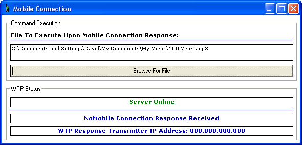



## Mobile Connection

### Description

This code is designed to help anyone who wishes to add remote commands to their applications. This program is more like a preview of this simple yet useful technology. This preview will allow you to execute any application using remote connections to your system either via a WAP mobile phone or normal internet browsers.

All you have to do is input your IP address in the address bar of the WAP or Internet Browser and in a matter of seconds Mobile Connection will detect the incoming connecting and carry out the command asked.

Imagine the use of this application if you have some creativity:

Remote Executed File Transfers

Remote Executed Backups

Remote Executed Shutdowns

And Much More&#8230;

Hope this helps everyone out here on PSC. This application is compatible with any Mobile Phone and any Connection Service Provider all over the world, as long as you have WAP activated on your cell phone.
 
### More Info
 

             |
---                |---
**Submitted On**   |2005-10-11 21:07:08
**By**             |[davidbugeja](https://github.com/Planet-Source-Code/PSCIndex/blob/master/ByAuthor/davidbugeja.md)
**Level**          |Advanced
**User Rating**    |4.9 (78 globes from 16 users)
**Compatibility**  |VB 6\.0
**Category**       |[Internet/ HTML](https://github.com/Planet-Source-Code/PSCIndex/blob/master/ByCategory/internet-html__1-34.md)
**World**          |[Visual Basic](https://github.com/Planet-Source-Code/PSCIndex/blob/master/ByWorld/visual-basic.md)
**Archive File**   |[Mobile\_Con199111512006\.zip](https://github.com/Planet-Source-Code/davidbugeja-mobile-connection__1-65161/archive/master.zip)

### API Declarations

In Source Code

